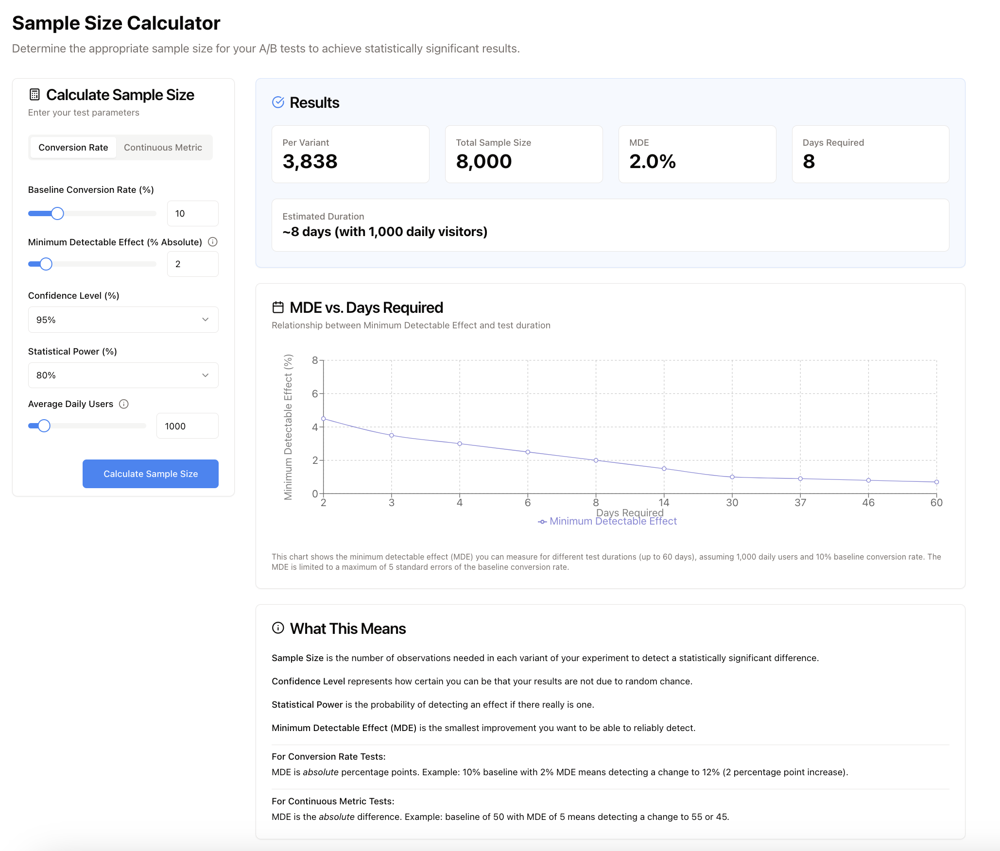
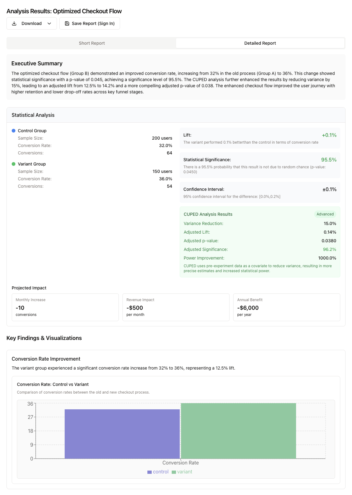
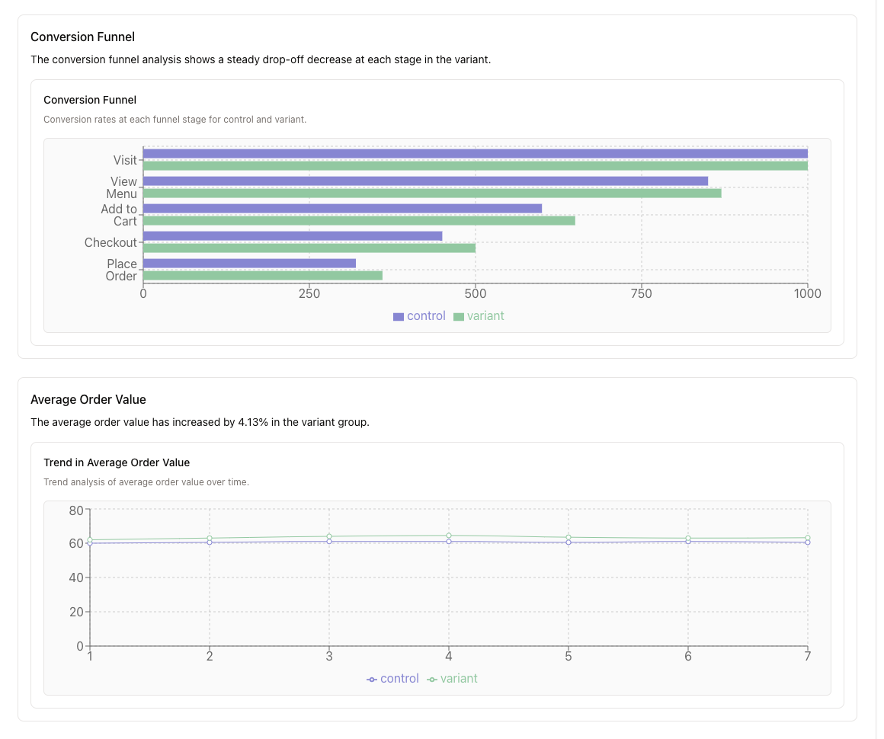
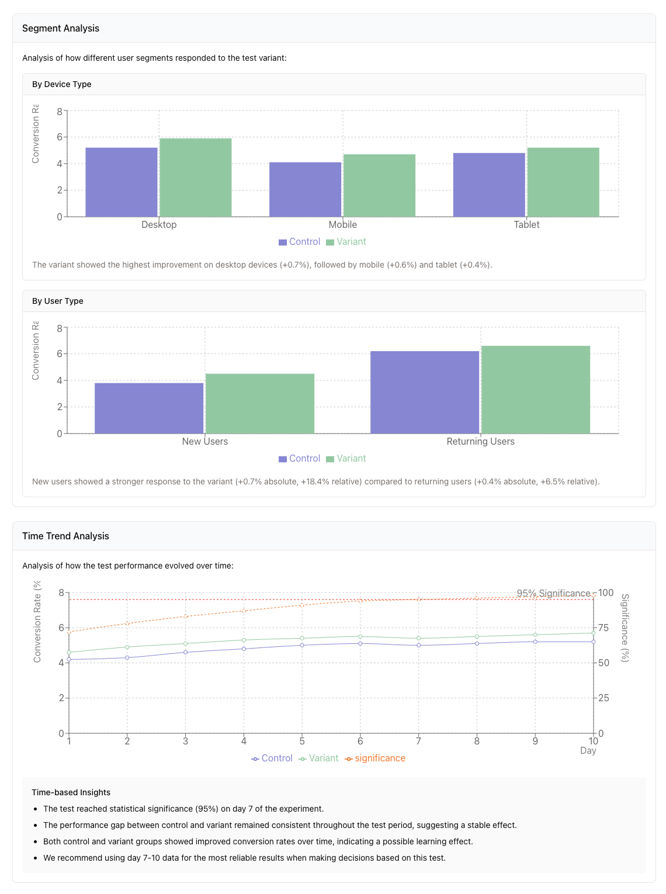
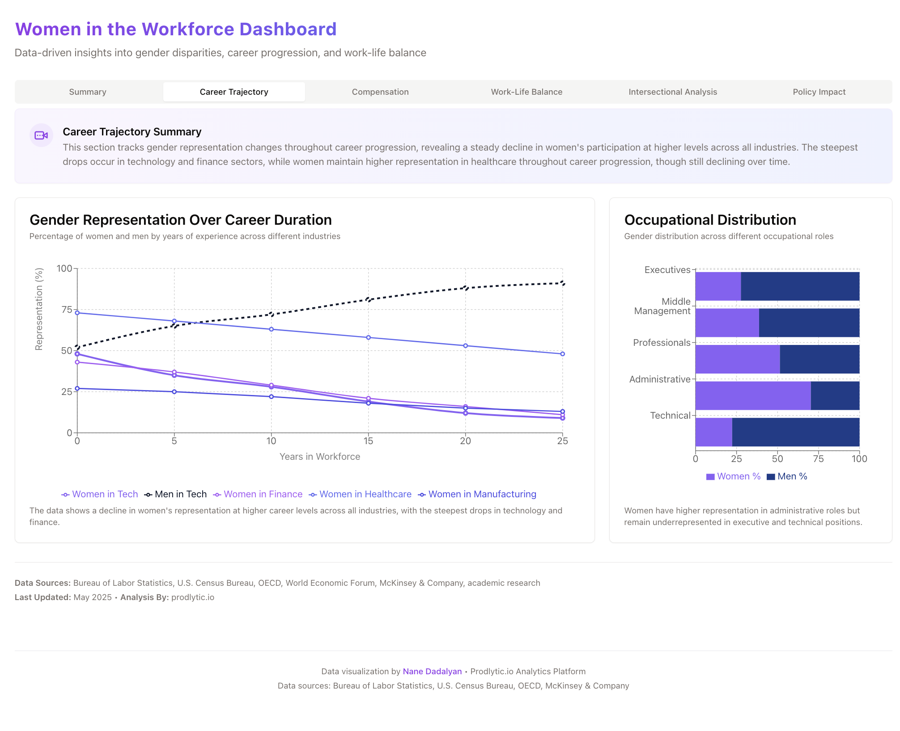

# Nane Dadalyan Portfolio
[find more in: naneda.dev](https://naneda.dev)

## Prodlytic.io Tools
I combined my data science expertise to create prodlytic.io for ai-powered data analytics. 
Here are some of the tools you can try now:

### A/B Sample Size Calculator
An interactive tool that helps product teams and marketers determine the minimum sample size required for statistically significant A/B tests.

__[Try it here: A/B Sample Size Calculator](https://prodlytic.io/tool/ab-sample-size-calculator)__

- Determines minimum sample requirements based on expected effect size
- Calculates statistical power and confidence levels
- Provides recommendations for test duration based on traffic estimates
- Helps teams avoid underpowered tests that lead to false conclusions

### A/B Report Generator
An automated reporting tool that transforms raw A/B test data into comprehensive, actionable reports.

__[Try it here: A/B Report Generator](https://prodlytic.io/tool/ab-report-generator)__

- Visual presentation of test results with confidence intervals
- Segmentation analysis to uncover insights in specific user groups
- Statistical significance calculations with p-values and effect sizes
- Automated recommendations based on test outcomes
- Export options for presentations and stakeholder communications

## Product Data Science Course
This Product Data Science Course is where theory meets real-world application in the product world. You'll get comfortable with statistical concepts, data analysis methods, and programming skills that'll help you make smarter product decisions backed by data.
### About the Course
- Statistical foundations you can actually apply to real product questions
- Cool probability distributions and when they'll come in handy
- Rock-solid techniques for estimation and confidence intervals
- Machine learning basics that you'll use in actual product scenarios
- Python skills tailored to your data analysis needs
- Object-oriented programming that'll help you build tools that scale
- Business metrics that genuinely drive product success
By the time you wrap up, you'll be pulling meaningful insights from product data, running rigorous tests, and sharing what you've found in ways that make sense to your team. We've balanced the science with hands-on practice so you can start applying these skills right away to make better, data-informed product decisions.

## Women in Workforce Life Dashboard

__[See it here: Women in Workforce](https://prodlytic.io/tool/hosted-dashboards/demo/women-workforce)__

An interactive data visualization dashboard that explores the experiences and challenges of women in the modern workforce.

## Luvu Family App

A mobile application designed to strengthen family connections through shared activities and communication.

### Project Overview

- **Role**: Lead Data Scientist
- **Scope**: End-to-end data science support from app concept to post-launch optimization
- **Impact**: Contributed to 45% increase in user retention through data-driven feature development

### Key Contributions

- Designed engagement tracking system using behavioral analytics
- Implemented recommendation algorithms for personalized family activities
- Created retention prediction models to identify at-risk users
- Developed A/B testing framework for feature optimization
- Built comprehensive analytics dashboard for product team

### Technologies Used

- Python (pandas, scikit-learn, TensorFlow)
- SQL for data extraction and analysis
- Firebase Analytics integration
- Custom event tracking implementation
- Automated reporting and alerting system

